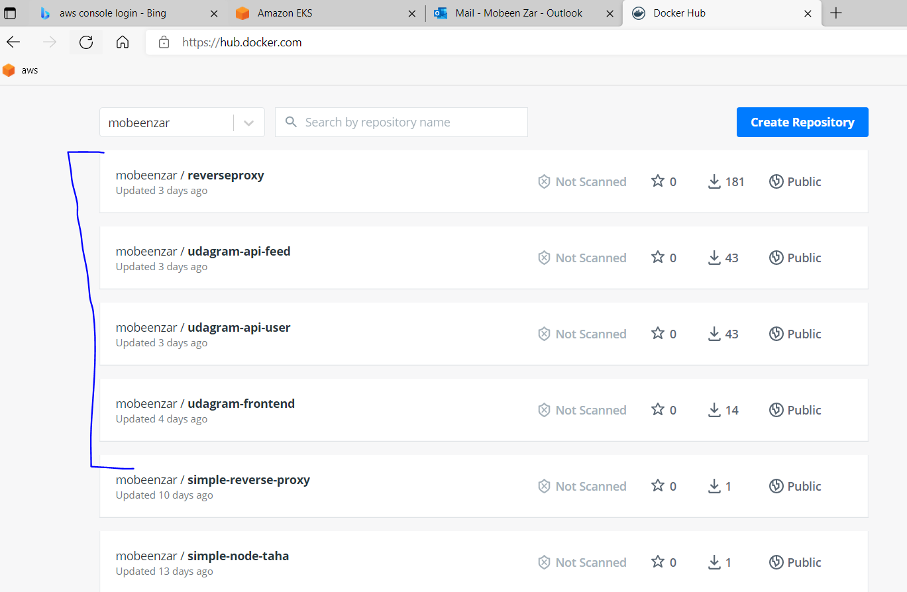
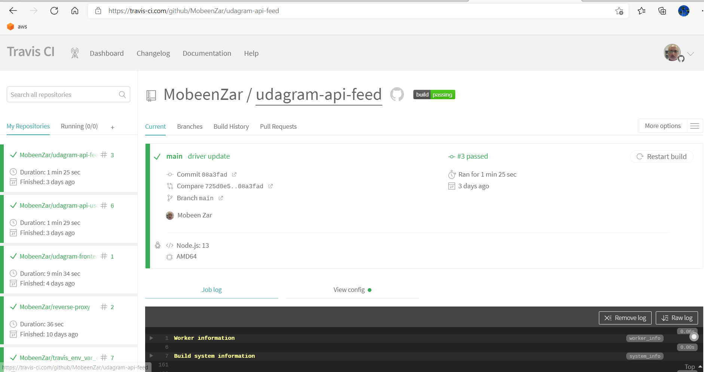
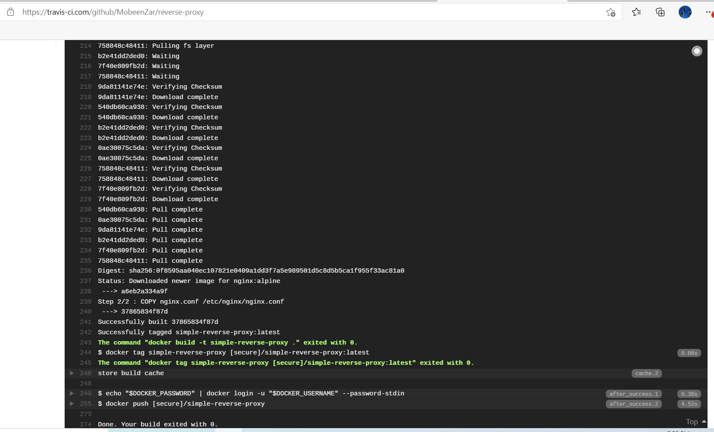
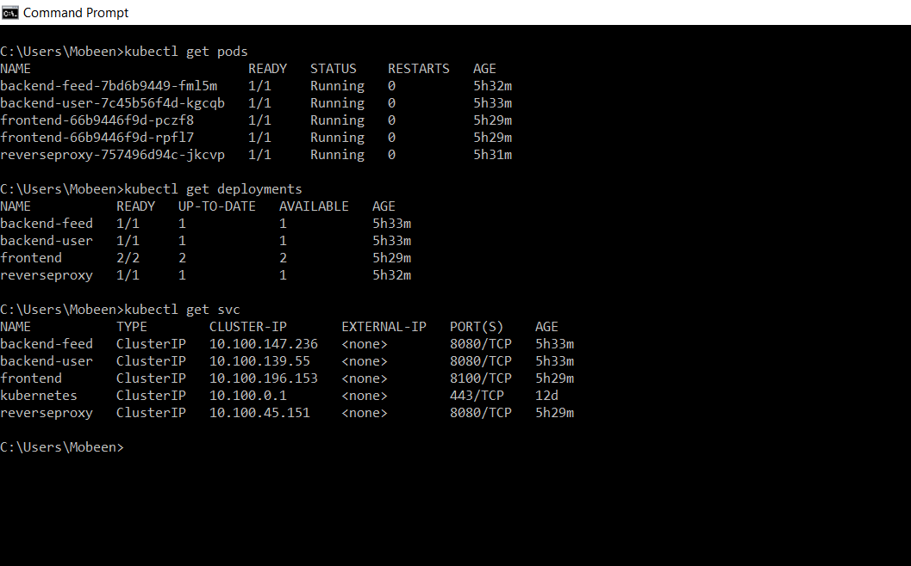
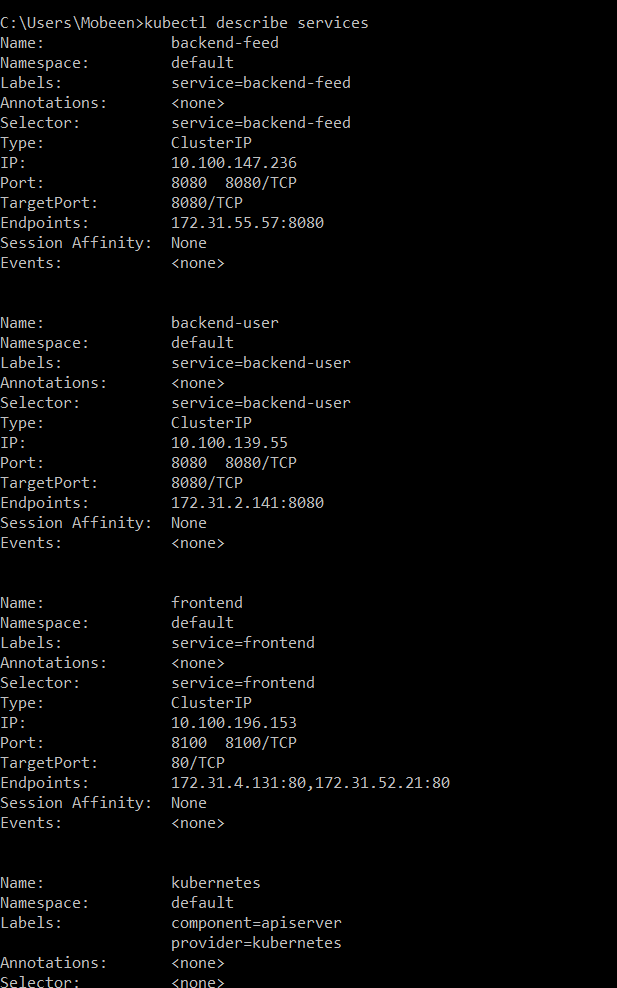
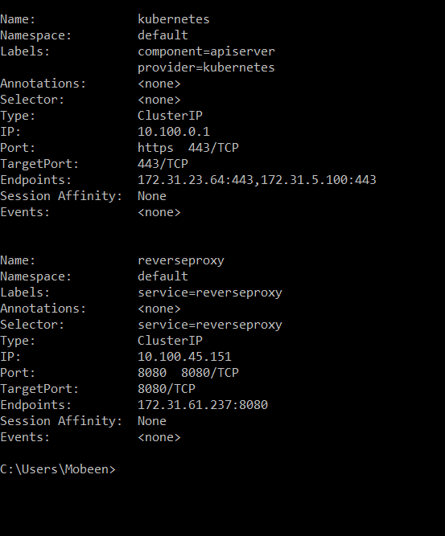
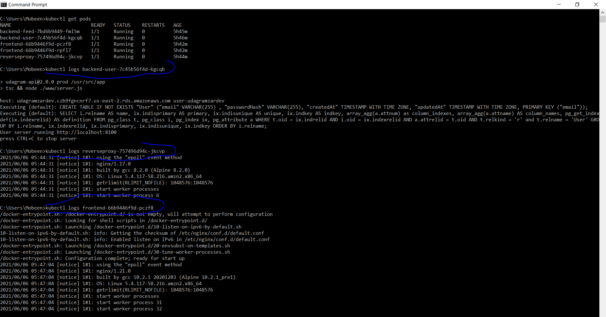
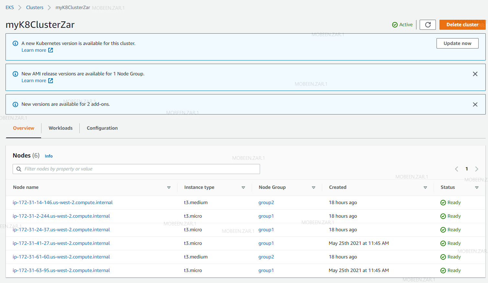

# Udagram Image Filtering Microservice

Udagram is a simple cloud application developed alongside the Udacity Cloud Engineering Nanodegree. It allows users to register and log into a web client, post photos to the feed, and process photos using an image filtering microservice.

### Screen Shots are in Screenshots folder

### Docker images in my repository in DockerHub

### TravisCI build pipeline showing successful build jobs

### Kubernetes kubectl get pods output

### Kubernetes kubectl describe services output

### Kubernetes kubectl describe hpa output)

### Kubernetes kubectl logs pod output

### Amazon EKS Cluster

### Test
#### Test 2

